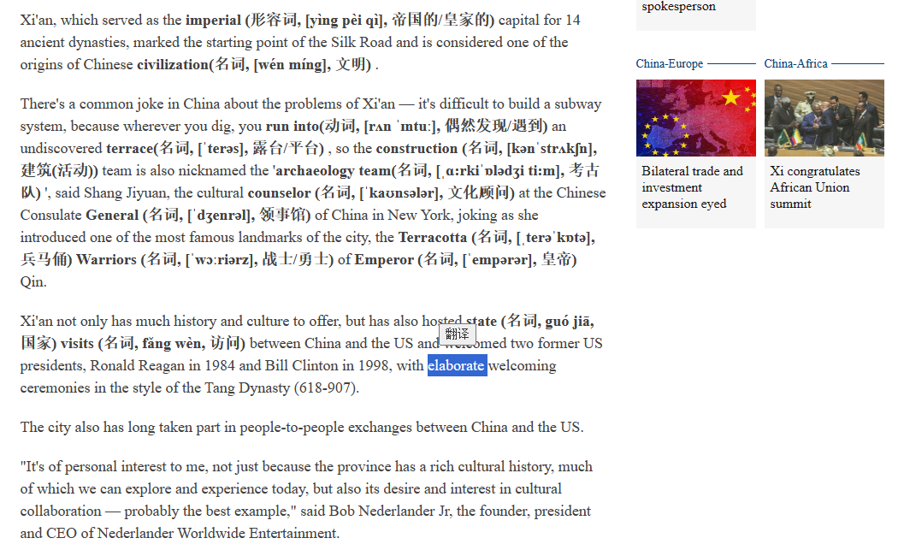

#  AI Word Helper (Chorme Extentions) AI单词助手（谷歌浏览器插件）

英文网站，划词查单词，还是看不懂？因为单词意思那么多，词性搞不清，上下文搞不清，出来的意思就没法用，GPT能够很好地帮助理解单词在句子中的意思，因此，开发了这样一个谷歌浏览器插件。选中单词，自动获取单词和单词所在段落，根据句子判别单词含义，并标注在单词后面。

## 展示

选中单词，点击翻译即可获取该单词的意思：


## 使用方法

修改AIWordHelper/content.js中第56行中的api-key，
```
56   const apiKey = 'your-api-key';
```
在浏览器中打开开发者模式，加载AIWordHelper插件即可使用。


## 联系作者
Email: 227229218@qq.com  

如果帮到了你，感谢您的赞助（❥(^\_-)：  
If this is helpful to you, Buy me a coffe（❥(^\_-):  
<!--    -->
  

## 版权声明
本系统服从GNU GPL开源协议。
